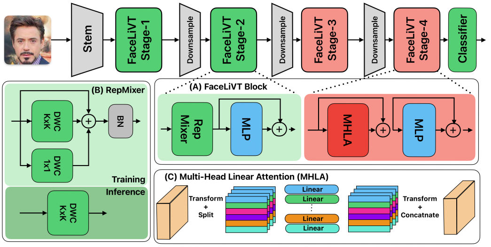

# FaceLiVT Series: Face Recognition using Linear Vision Transformer

[](https://paperswithcode.com/sota/lightweight-face-recognition-on-lfw?p=edgeface-efficient-face-recognition-model-for)
[](https://paperswithcode.com/sota/lightweight-face-recognition-on-calfw?p=edgeface-efficient-face-recognition-model-for)
[](https://paperswithcode.com/sota/lightweight-face-recognition-on-cplfw?p=edgeface-efficient-face-recognition-model-for)
[](https://paperswithcode.com/sota/lightweight-face-recognition-on-cfp-fp?p=edgeface-efficient-face-recognition-model-for)
[](https://paperswithcode.com/sota/lightweight-face-recognition-on-agedb-30?p=edgeface-efficient-face-recognition-model-for)	
[](https://paperswithcode.com/sota/lightweight-face-recognition-on-ijb-b?p=edgeface-efficient-face-recognition-model-for)	
[](https://paperswithcode.com/sota/lightweight-face-recognition-on-ijb-c?p=edgeface-efficient-face-recognition-model-for)	

[](https://arxiv.org/abs/2506.10361)

Official gitlab repository for FaceLiVT Series: Face Recognition using Linear Vision Transformer
published in IEEE International Conference on Image Processing.


> Abstract: his paper introduces FaceLiVT, a lightweight yet powerful face recognition model that integrates a hybrid Convolution Neural Network (CNN)-Transformer architecture with an innovative and lightweight Multi-Head Linear Attention (MHLA) mechanism. By combining MHLA alongside a reparameterized token mixer, FaceLiVT effectively reduces computational complexity while preserving competitive accuracy. Extensive evaluations on challenging benchmarks; including LFW, CFP-FP, AgeDB-30, IJB-B, and IJB-C; highlight its superior performance compared to state-of-the-art lightweight models. MHLA notably improves inference speed, allowing FaceLiVT to deliver high accuracy with lower latency on mobile devices. Specifically, FaceLiVT is 8.6 faster than EdgeFace, a recent hybrid CNN-Transformer model optimized for edge devices, and 21.2 faster than a pure ViT-Based model. With its balanced design, FaceLiVT offers an efficient and practical solution for real-time face recognition on resource-constrained platforms.
```angular2html
@article{setyawan2025facelivt,
  title={FaceLiVT: Face Recognition using Linear Vision Transformer with Structural Reparameterization For Mobile Device},
  author={Setyawan, Novendra and Sun, Chi-Chia and Hsu, Mao-Hsiu and Kuo, Wen-Kai and Hsieh, Jun-Wei},
  journal={arXiv preprint arXiv:2506.10361},
  year={2025}
}
```

## Installation Instructions

### Step 1: Install Necessary Components

Install dependencies of Insight face repo. You can find them [here](https://github.com/deepinsight/insightface/tree/master/recognition/arcface_torch). Install [DALI](https://github.com/deepinsight/insightface/blob/master/recognition/arcface_torch/docs/install_dali.md) as well.

#### Substep: Install PyTorch

Install PyTorch to 2.0.0 with CUDA.

### Step 2: Install TIMM

Run the following commands:

```bash
pip install timm==0.6.12
pip install pandas tabulate mxnet
```




The following code shows how to use the model for inference:
```python
import torch
from torchvision import transforms
from face_alignment import align
from backbones import get_model
arch="facelivt_s"# or "facelivt_m" # 
model=get_model(arch)

transform = transforms.Compose([
            transforms.ToTensor(),
            transforms.Normalize(mean=[0.5, 0.5, 0.5], std=[0.5, 0.5, 0.5]),
            ])

checkpoint_path=f'checkpoints/{arch}.pt'
model.load_state_dict(torch.load(checkpoint_path, map_location='cpu'))
model.eval()
path = 'checkpoints/synthface.jpeg'
aligned = align.get_aligned_face(path)
transformed_input = transform(aligned).unsqueeze(0)
embedding = model(transformed_input)
print(embedding.shape)

```


### Step 3: Understand Configurations

There are two configurations in this source code. The mappings of names and method names in the results are:

- Method Name : `{name}`
- Idiap facelivt_s : `facelivt_s`
- Idiap facelivt_m : `facelivt_s`

To see the model parameters, flops, and size on disk, run the following commands:

```bash
python speed_gpu.py facelivt_s
python speed_gpu.py facelivt_m
```


### Step 4: Data Preparation

Download and prepare WebFace4M and WebFace12M: place the `.rec` files in `data/webface4m` and `data/webface12m`. You can find more instructions [here](https://github.com/deepinsight/insightface/blob/master/recognition/arcface_torch/docs/prepare_webface42m.md).

### Step 5: Training

#### FaceLiVT-S

Launch the following command after setting the root path and output path in the config files:

```bash
torchrun --nproc_per_node=8 train_v2.py configs/edgeface_s_gamma_05.py
```
After finishing this step, launch:

```bash
torchrun --nproc_per_node=8 train_v2_restart.py configs/edgeface_s_gamma_05_restart.py
```

#### FaceLiVT-S

Launch the following command after setting the root path and output path in the config files:

```bash
torchrun --nproc_per_node=4 train_v2.py configs/distil_glint360k_facelivt_m_li.py
```
After finishing this step, launch:

```bash
torchrun --nproc_per_node=4 train_v2_restart.py configs/distil_glint360k_facelivt_m_li.py
```


# EdgeFace Models via `torch.hub`

## Available Models

- `facelivt_s`


## Usage

You can load the models using `torch.hub` as follows:

```python
import torch
variant='edgeface_xs_gamma_06'
model = torch.hub.load('otroshi/edgeface', variant, source='github', pretrained=True)
model.eval()


> :warning: **Note About the License:** Please refer to the `LICENSE` file in the parent directory for information about the license terms and conditions.
