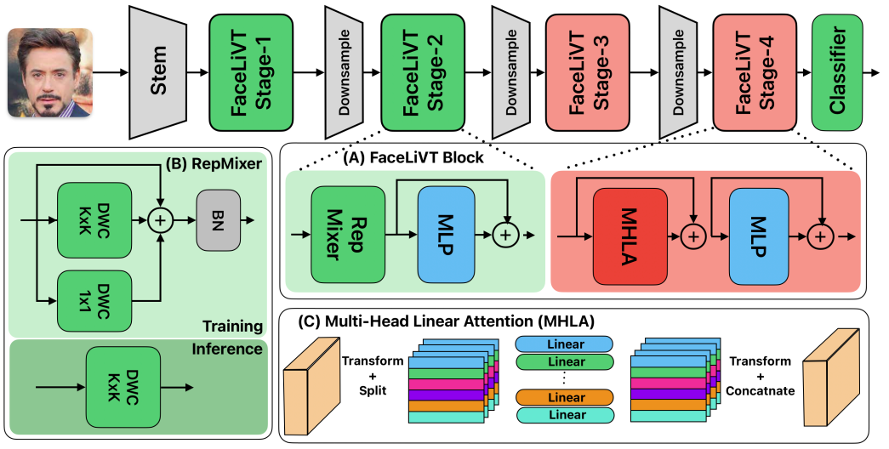

# FaceLiVT Series: Face Recognition using Linear Vision Transformer

[](https://arxiv.org/abs/2506.10361)
[](https://ieeexplore.ieee.org/abstract/document/11084611)
[](https://ieeexplore.ieee.org/abstract/document/11376969)

Official repository for FaceLiVT Series: Face Recognition using Linear Vision Transformer.

---

## Overview

The FaceLiVT series introduces hybrid CNN–Transformer architectures with lightweight linear attention mechanisms for efficient mobile face recognition. The series currently includes two generations:

| Version | Venue | Key Contribution |
|:---|:---|:---|
| **FaceLiVTv1** | IEEE ICIP 2025 & IEEE APCCAS 2025 | Multi-Head Linear Attention (MHLA) with structural reparameterization |
| **FaceLiVTv2** | IEEE TBIOM (Under Review) | Lite MHLA with affine rescale transformation, GDConv head, unified RepMix–Lite MHLA block |

---

## FaceLiVTv1

> **FaceLiVT: Face Recognition Using Linear Vision Transformer with Structural Reparameterization for Mobile Device**
> 
> Published in *IEEE International Conference on Image Processing (ICIP) 2025* and *IEEE Asia Pacific Conference on Circuits and Systems (APCCAS) 2025*.

**Abstract**: This paper introduces FaceLiVT, a lightweight yet powerful face recognition model that integrates a hybrid Convolution Neural Network (CNN)-Transformer architecture with an innovative and lightweight Multi-Head Linear Attention (MHLA) mechanism. By combining MHLA alongside a reparameterized token mixer, FaceLiVT effectively reduces computational complexity while preserving competitive accuracy. Extensive evaluations on challenging benchmarks; including LFW, CFP-FP, AgeDB-30, IJB-B, and IJB-C; highlight its superior performance compared to state-of-the-art lightweight models. MHLA notably improves inference speed, allowing FaceLiVT to deliver high accuracy with lower latency on mobile devices. Specifically, FaceLiVT is 8.6× faster than EdgeFace, a recent hybrid CNN-Transformer model optimized for edge devices, and 21.2× faster than a pure ViT-Based model. With its balanced design, FaceLiVT offers an efficient and practical solution for real-time face recognition on resource-constrained platforms.



```bibtex
@INPROCEEDINGS{setyawan2025facelivt,
  author={Setyawan, Novendra and Sun, Chi-Chia and Hsu, Mao-Hsiu and Kuo, Wen-Kai and Hsieh, Jun-Wei},
  booktitle={2025 IEEE International Conference on Image Processing (ICIP)}, 
  title={FaceLiVT: Face Recognition Using Linear Vision Transformer with Structural Reparameterization for Mobile Device}, 
  year={2025},
  volume={},
  number={},
  pages={1720-1725},
  keywords={Performance evaluation;Computer vision;Accuracy;Face recognition;Computational modeling;Computer architecture;Benchmark testing;Transformers;Mobile;Real-time systems;Face Recognition;Vision Transformer;Multi-Head Linear Attention (MHLA);Structural Reparameterization;Lightweight Model},
  doi={10.1109/ICIP55913.2025.11084611}}
```
```bibtex
@inproceedings{setyawan2025facelivt,
  title={FaceLiVT: Energy Efficient Face Recognition with Linear Vision Transformer for Limited Resource Device},
  author={Setyawan, Novendra and Gu, Jun-Xian and Sun, Chi-Chia and Hsu, Mao-Hsiu and Kuo, Wen-Kai and Shen, Chung-An and Hsieh, Jun-Wei},
  booktitle={2025 IEEE Asia Pacific Conference on Circuits and Systems (APCCAS)},
  pages={1--5},
  year={2025},
  organization={IEEE}
}
```

### FaceLiVTv1 Model Variants

| Model | MAdds | Params |
|:---|:---:|:---:|
| `facelivt_s` | 160 | 5.05 M |
| `facelivt_m` | 386 | 9.75 M |

---

## FaceLiVTv2

> **FaceLiVTv2: An Improved Baseline Hybrid Architecture for Efficient Mobile Face Recognition**
>
> Submitted to *IEEE Transactions on Biometrics, Behavior, and Identity Science (TBIOM)*.

**Abstract**: Lightweight face recognition is increasingly important for deployment on edge and mobile devices, where strict constraints on latency, memory, and energy consumption must be met alongside reliable accuracy. Although recent hybrid CNN-Transformer architectures have advanced global context modeling, striking an effective balance between recognition performance and computational efficiency remains an open challenge. In this work, we present FaceLiVTv2, an improved version of our FaceLiVT hybrid architecture designed for efficient global–local feature interaction in mobile face recognition. At its core is Lite MHLA, a lightweight global token interaction module that replaces the original multi-layer attention design with multi-head linear token projections and affine rescale transformations, reducing redundancy while preserving representational diversity across heads. We further integrate Lite MHLA into a unified RepMix block that coordinates local and global feature interactions and adopts global depthwise convolution for adaptive spatial aggregation in the embedding stage. Extensive experiments on LFW, CA-LFW, CP-LFW, CFP-FP, AgeDB-30, and IJB show that FaceLiVTv2 consistently improves the accuracy-efficiency trade-off over existing lightweight methods. Notably, FaceLiVTv2 reduces mobile inference latency by 22% relative to FaceLiVTv1, achieves speedups of up to 30.8% over GhostFaceNets on mobile devices, and delivers 20-41% latency improvements over EdgeFace and KANFace across platforms while maintaining higher recognition accuracy.

<!-- TODO: Add FaceLiVTv2 architecture figure -->
<!--  -->

### Key Improvements over FaceLiVTv1

| Component | FaceLiVTv1 | FaceLiVTv2 |
|:---|:---|:---|
| **Global Token Interaction** | MHLA (2-layer MLP-style: Linear–GELU–Linear) | Lite MHLA (single linear projection per head, activation-free) |
| **Normalization** | LayerNorm | Affine Rescale Transformation (`Aff(X) = α ⊙ X + β`) |
| **Block Design** | Separate RepMix + MHLA branches | Unified RepMix–Lite MHLA block |
| **Stage Strategy** | Same mixing across all stages | Stage-specific: RepMix+FFN (stages 1-2), RepMix+LiteMHLA+FFN (stages 3-4) |
| **Embedding Head** | Global Average Pooling (GAP) | Global Depthwise Convolution (GDConv) for adaptive spatial aggregation |
| **Complexity** | `2(NrN)C` per MHLA block | `≈ N²C + ε` per Lite MHLA block |

### FaceLiVTv2 Model Variants

| Model | Channels (S1/S2/S3/S4) | MAdds (M) | Params (M) |
|:---|:---:|:---:|:---:|
| `facelivtv2_xs` | 32 / 64 / 128 / 256 | 90 | 2.9 |
| `facelivtv2_s` | 48 / 96 / 192 / 384 | 179 | 4.62 |
| `facelivtv2_m` | 56 / 112 / 224 / 448 | 258 | 7.04 |
| `facelivtv2_l` | 64 / 128 / 256 / 512 | 309 | 8.52 |


## Installation Instructions

### Step 1: Install Necessary Components

Install dependencies of Insight face repo. You can find them [here](https://github.com/deepinsight/insightface/tree/master/recognition/arcface_torch). Install [DALI](https://github.com/deepinsight/insightface/blob/master/recognition/arcface_torch/docs/install_dali.md) as well.

#### Substep: Install PyTorch

Install PyTorch to 2.0.0 with CUDA.

### Step 2: Install TIMM

Run the following commands:

```bash
pip install timm==0.6.12
pip install pandas tabulate mxnet
```

### Step 3: Understand Configurations

There are two generations with multiple configurations in this source code:

**FaceLiVTv1:**
- `facelivt_s` : FaceLiVTv1-Small
- `facelivt_m` : FaceLiVTv1-Medium

**FaceLiVTv2:**
- `facelivtv2_xs` : FaceLiVTv2-XSmall (2.9M params, 90M MAdds)
- `facelivtv2_s` : FaceLiVTv2-Small (4.62M params, 179M MAdds)
- `facelivtv2_m` : FaceLiVTv2-Medium (7.04M params, 258M MAdds)
- `facelivtv2_l` : FaceLiVTv2-Large (8.52M params, 309M MAdds)

To see the model parameters, flops, and size on disk, run the following commands:

```bash
# FaceLiVTv1
python speed_gpu.py facelivt_s
python speed_gpu.py facelivt_m

# FaceLiVTv2
python speed_gpu.py facelivtv2_xs
python speed_gpu.py facelivtv2_s
python speed_gpu.py facelivtv2_m
python speed_gpu.py facelivtv2_l
```

---

## Inference

The following code shows how to use the model for inference:

```python
import torch
from torchvision import transforms
from face_alignment import align
from backbones import get_model

# Choose architecture: "facelivt_s", "facelivt_m" for v1
#                      "facelivtv2_xs", "facelivtv2_s", "facelivtv2_m", "facelivtv2_l" for v2
arch="facelivtv2_s"
model=get_model(arch)

transform = transforms.Compose([
            transforms.ToTensor(),
            transforms.Normalize(mean=[0.5, 0.5, 0.5], std=[0.5, 0.5, 0.5]),
            ])

checkpoint_path=f'checkpoints/{arch}.pt'
model.load_state_dict(torch.load(checkpoint_path, map_location='cpu'))
model.eval()
path = 'checkpoints/synthface.jpeg'
aligned = align.get_aligned_face(path)
transformed_input = transform(aligned).unsqueeze(0)
embedding = model(transformed_input)
print(embedding.shape)

```

---

## Data Preparation

### Glint360K (Main Training)

Download and prepare Glint360K: place the `.rec` files in `data/glint360k`. You can find more instructions [here](https://github.com/deepinsight/insightface/blob/master/recognition/arcface_torch/docs/prepare_webface42m.md).

### WebFace4M / WebFace12M (Optional)

Download and prepare WebFace4M and WebFace12M: place the `.rec` files in `data/webface4m` and `data/webface12m`.

### TinyFace (Low-Resolution Fine-tuning for FaceLiVTv2)

Download and prepare the [TinyFace](https://qmul-tinyface.github.io/) dataset for low-resolution face recognition evaluation.


---

## Training

### FaceLiVTv1

#### FaceLiVT-S

Launch the following command after setting the root path and output path in the config files:

```bash
torchrun --nproc_per_node=8 train_v2.py configs/distil_glint360k_facelivt_s_li.py
```

#### FaceLiVT-M

Launch the following command after setting the root path and output path in the config files:

```bash
torchrun --nproc_per_node=4 train_v2.py configs/distil_glint360k_facelivt_m_li.py
```

### FaceLiVTv2

Training was performed over 50 epochs with a total batch size of 1026 on three NVIDIA RTX A6000 GPUs. AdamW optimizer with polynomial decay learning rate scheduler, initial learning rate of 6e-3, and l2 regularization of 1e-2.

#### FaceLiVTv2-XS

```bash
torchrun --nproc_per_node=3 train_v2.py configs/glint360k_facelivtv2_xs.py
```

#### FaceLiVTv2-S

```bash
torchrun --nproc_per_node=3 train_v2.py configs/glint360k_facelivtv2_s.py
```

#### FaceLiVTv2-M

```bash
torchrun --nproc_per_node=3 train_v2.py configs/glint360k_facelivtv2_m.py
```

#### FaceLiVTv2-L

```bash
torchrun --nproc_per_node=3 train_v2.py configs/glint360k_facelivtv2_l.py
```

#### TinyFace Fine-tuning (FaceLiVTv2)

For low-resolution face recognition evaluation on TinyFace, fine-tune the pretrained model for 40 epochs with batch size 8, AdamW optimizer, and initial learning rate of 2e-4. No distillation or restoration is applied.

```bash
python train_tinyface.py configs/tinyface_facelivtv2_s.py --pretrained checkpoints/facelivtv2_s.pt
```

---

## Evaluation Benchmarks

| Benchmark | Type | Protocol |
|:---|:---|:---|
| LFW | Face Verification | 6,000 pairs |
| CA-LFW | Cross-Age Verification | Age variation |
| CP-LFW | Cross-Pose Verification | Pose variation |
| CFP-FP | Frontal-Profile Verification | Profile variation |
| AgeDB-30 | Age-gap Verification | 30-year age gap |
| IJB-B | Mixed Verification/Identification | 1,845 subjects |
| IJB-C | Mixed Verification/Identification | 3,531 subjects |
| TinyFace | Low-Resolution Retrieval | Rank-1/5/10 (FaceLiVTv2) |


### Results

Comparison of FaceLiVTv2 variants with SOTA on FR benchmark dataset. FLOPs and mobile latency are measured in 112 × 112 input size on iPhone 15 Pro.

#### Large Models (> 600M FLOPs)

| Model | Year | Param (M) | FLOPs (M) | Training Dataset | LFW | CA-LFW | CP-LFW | CFP-FP | AgeDB30 | IJB-B | IJB-C | Mean Acc(%) | Mobile Latency (ms) |
|:---|:---:|:---:|:---:|:---|:---:|:---:|:---:|:---:|:---:|:---:|:---:|:---:|:---:|
| TransFace-S [15] | '23 | 86.7 | 5.8G | Glint360K | 99.85 | - | - | 98.91 | 98.50 | - | 97.33 | - | 14.31 |
| ResNet50-ArcFace [3] | '22 | 43.6 | 6.3G | Glint360K | 99.78 | - | - | 98.77 | 98.28 | - | 95.65 | - | 3.76 |
| VarGFaceNet [7] | '19 | 5.0 | 1022 | MS1MV3 | 99.85 | 95.15 | 88.55 | 98.50 | 98.15 | 92.90 | 94.70 | 95.40 | 0.83 |
| SwiftFaceFormer-L1 [11] | '24 | 11.8 | 805 | MS1MV3 | 99.68 | 95.80 | 90.10 | 96.61 | 96.95 | 91.81 | 93.82 | 95.25 | 1.20 |
| PocketNetM256 [38] | '22 | 1.75 | 1099 | CASIA-WF | 99.58 | 95.63 | 90.03 | 95.66 | 97.17 | 90.74 | 92.70 | 94.50 | 0.98 |
| PocketNetM128 [38] | '22 | 1.68 | 1099 | CASIA-WF | 99.65 | 95.67 | 90.00 | 95.07 | 96.78 | 90.63 | 92.63 | 94.35 | 0.98 |
| MixFaceNets-M [8] | '21 | 3.9 | 626 | MS1MV2 | 99.68 | - | - | - | 97.05 | 91.55 | 93.42 | - | 0.70 |

#### Medium Models (300–600M FLOPs)

| Model | Year | Param (M) | FLOPs (M) | Training Dataset | LFW | CA-LFW | CP-LFW | CFP-FP | AgeDB30 | IJB-B | IJB-C | Mean Acc(%) | Mobile Latency (ms) |
|:---|:---:|:---:|:---:|:---|:---:|:---:|:---:|:---:|:---:|:---:|:---:|:---:|:---:|
| KANFace-0.5 [12] | '25 | 6.80 | 397 | WebFace12M | 99.82 | 95.48 | 92.65 | 98.31 | 96.90 | 93.69 | 95.64 | 96.07 | 9.98 |
| FaceLiVTv1-M [20] | '25 | 9.8 | 386 | Glint360K | 99.70 | 95.76 | 90.97 | 97.20 | 97.60 | 93.70 | 95.70 | 95.80 | 0.67 |
| EdgeFace-S [10] | '24 | 3.6 | 306 | WebFace12M | 99.78 | 95.71 | 92.56 | 95.81 | 96.93 | 93.59 | 95.63 | 95.72 | 9.89 |
| MobileFaceNet [6] | '21 | 0.99 | 440 | MS1MV2 | 99.70 | 95.20 | 89.22 | 96.90 | 97.60 | 92.83 | 94.70 | 95.16 | 0.77 |
| ShuffleFaceNet-1.5 [6], [32] | '21 | 2.6 | 577 | MS1MV2 | 99.67 | 95.05 | 88.50 | 97.26 | 97.32 | 92.30 | 94.30 | 94.91 | 0.69 |
| SwiftFaceFormer-S [11] | '24 | 6.0 | 485 | MS1MV3 | 99.60 | 95.78 | 90.00 | 96.49 | 96.83 | 91.56 | 93.54 | 94.83 | 0.65 |
| PocketNetS128 [38] | '22 | 0.92 | 587 | CASIA-WF | 99.58 | 95.48 | 88.63 | 94.21 | 96.10 | 89.44 | 91.62 | 93.58 | 0.88 |
| PocketNetS256 [38] | '22 | 0.99 | 587 | CASIA-WF | 99.66 | 95.50 | 88.93 | 93.34 | 96.36 | 89.31 | 91.33 | 93.49 | 0.88 |

#### Small Models (100–300M FLOPs)

| Model | Year | Param (M) | FLOPs (M) | Training Dataset | LFW | CA-LFW | CP-LFW | CFP-FP | AgeDB30 | IJB-B | IJB-C | Mean Acc(%) | Mobile Latency (ms) |
|:---|:---:|:---:|:---:|:---|:---:|:---:|:---:|:---:|:---:|:---:|:---:|:---:|:---:|
| GhostFaceNetV1-1 [9] | '23 | 4.1 | 216 | MS1MV3 | 99.73 | 95.93 | 91.93 | 96.83 | 98.00 | 93.12 | 94.94 | 95.78 | 0.78 |
| KANFace-0.6 [12] | '25 | 4.74 | 240 | WebFace12M | 99.65 | 95.32 | 91.47 | 97.17 | 95.52 | 92.95 | 94.75 | 95.26 | 6.52 |
| EdgeFace-XS [10] | '24 | 1.77 | 154 | WebFace12M | 99.73 | 95.28 | 91.82 | 94.37 | 96.00 | 92.67 | 94.85 | 94.96 | 5.82 |
| FaceLiVTv1-S [20] | '25 | 5.89 | 237 | Glint360K | 99.70 | 95.63 | 90.70 | 95.10 | 96.60 | 91.20 | 92.70 | 94.52 | 0.47 |

#### Tiny Models (< 100M FLOPs)

| Model | Year | Param (M) | FLOPs (M) | Training Dataset | LFW | CA-LFW | CP-LFW | CFP-FP | AgeDB30 | IJB-B | IJB-C | Mean Acc(%) | Mobile Latency (ms) |
|:---|:---:|:---:|:---:|:---|:---:|:---:|:---:|:---:|:---:|:---:|:---:|:---:|:---:|
| GhostFaceNetV2-2 [9] | '23 | 6.8 | 77 | MS1MV3 | 99.68 | 95.73 | 90.17 | 94.29 | 96.83 | 91.89 | 93.16 | 94.54 | 0.67 |
| GhostFaceNetV1-2 [9] | '23 | 4.1 | 60 | MS1MV3 | 99.68 | 95.60 | 90.07 | 93.31 | 96.92 | 91.25 | 93.45 | 94.33 | 0.60 |
| ShuffleFaceNet-0.5 [6], [32] | '21 | 1.4 | 67 | MS1MV2 | 99.20 | - | - | 92.60 | 93.20 | - | - | - | 0.45 |

#### FaceLiVTv2 (Ours)

| Model | Param (M) | FLOPs (M) | Training Dataset | LFW | CA-LFW | CP-LFW | CFP-FP | AgeDB30 | IJB-B | IJB-C | Mean Acc(%) | Mobile Latency (ms) |
|:---|:---:|:---:|:---|:---:|:---:|:---:|:---:|:---:|:---:|:---:|:---:|:---:|
| **FaceLiVTv2-L** | 8.52 | 309 | Glint360K | 99.80 | 96.00 | 93.07 | 98.26 | 98.02 | 95.18 | 96.59 | **96.70(+0.63)** | **0.71(14.0×↓)** |
| **FaceLiVTv2-M** | 7.02 | 258 | Glint360K | 99.78 | 96.12 | 92.92 | 97.93 | 98.10 | 95.02 | 96.42 | **96.61(+0.83)** | **0.65(16.7%↓)** |
| **FaceLiVTv2-S** | 4.62 | 179 | Glint360K | 99.78 | 95.93 | 92.45 | 97.47 | 97.82 | 94.51 | 95.99 | **96.28(+0.50)** | **0.54(30.8%↓)** |
| **FaceLiVTv2-XS** | 2.9 | 90 | Glint360K | 99.63 | 95.58 | 90.38 | 95.23 | 96.68 | 90.67 | 91.25 | 94.20(-0.24) | **0.43(35.8%↓)** |

---

## Pretrained Models

<!-- TODO: Add download links for pretrained models -->

| Model | Training Data | Checkpoint |
|:---|:---|:---|
| `facelivt_s` | Glint360K | [Download](#) |
| `facelivt_m` | Glint360K | [Download](#) |
| `facelivtv2_xs` | Glint360K | [Download](#) |
| `facelivtv2_s` | Glint360K | [Download](#) |
| `facelivtv2_m` | Glint360K | [Download](#) |
| `facelivtv2_l` | Glint360K | [Download](#) |

---

## Acknowledgements

This work was conducted in collaboration between the Department of Electro-Optics at National Formosa University, the Department of Electrical Engineering at National Taipei University, and the College of Artificial Intelligence and Green Energy at National Yang Ming Chiao Tung University.

---

> :warning: **Note About the License:** Please refer to the `LICENSE` file in the parent directory for information about the license terms and conditions.
